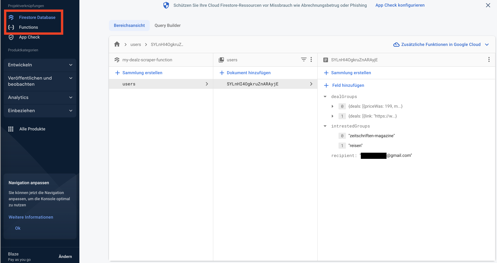
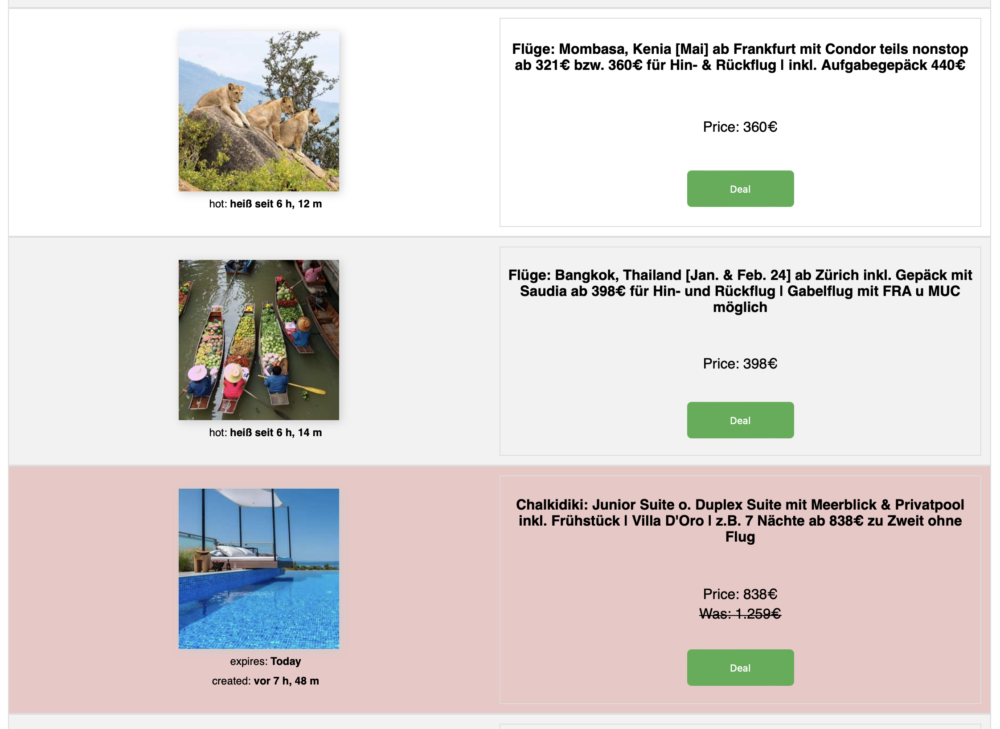
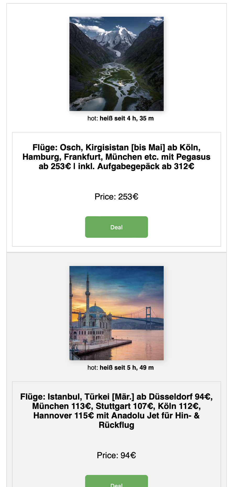

# Mydealz web scraper

This is a TypeScript-based web scraper that scrapes deals on MyDealz every day at a specific time (18:00) and sends them to your email. It uses Node.js, Nodemailer, and Cheerio.

> This is ment to be a fun and learning project. But of cause I'm happy if you would like to contribute (See contribute section).

# How to
## Deploy to firebase
Follow the istruction on: [Firebase Docs](https://firebase.google.com/docs/functions/get-started?hl=de)

> Node version 16 required.
`firebase deploy --only functions`

## Test (function locally)
0. Install firebase CLI
1. Set up your own test password in the .env file.
2. Use function `functions.https.onCall(async (data: any) => {`
3. Go to terminal
4. Go to function folder `cd functions`
5. Run `npm run shell`
6. Execute function `myDealzScraper({data: '<your_test_password>'})`

> Of cause this works online as well. Then you need your firebase function url.


# Installation
Clone the repository to your local machine:
```bash
git clone https://github.com/marcello-a/mydealz-scraper.git
```
Navigate to the project directory:
```bash
cd mydealz-scraper/functions
```
Install the dependencies:
```
npm install
```

# Configuration
Before running the scraper, you need to configure the following:

> create a .env file in `.functions/.env`

> It sould have 
>
>EMAIL_USER=""
>
>EMAIL_PASS=""
>
>TEST_SECRET=""

## Email Settings
Set up your email account to send emails through Node.js using Nodemailer. This scraper uses GMX as a default email service, but you can configure it for other email providers as well.

You need to provide your email address and password in the .env file placed into the function folder:

```makefile
EMAIL_USER=your_email_address
EMAIL_PASS=your_email_password
```

## Firebase
Add a Firestore and add a user to it.


## Recipients and intrested groups
Add recipients in the firestore Database. You can add different recipients with different deal groups. A feature is that it scrapes similar deal groups just one time and sends it to all recipients depending on their past for performance reasons.

> Note that intrestedGroups are the deal group represented in the url. E.g. `https://www.mydealz.de/gruppe/reisen`

Firestore example:
```
{
  "dealGroups": [],
  "intrestedGroups": [
    "reisen",
    "zeitschriften-magazine"
  ],
  "recipient": "me@example.com"
}
```

## Schedule
Set the time and timezone when you want to scrape the deals in the [config/schedule.ts](./functions/src/config/schedule.ts) file. The format is as usal in crontab. See [crontab.guru](https://crontab.guru/) for help

Example:

```ts
export const SCHEDULE = '0 18 * * *'; // Run at 18:00 https://crontab.guru/#0_18_*_*_*
export const TIMEZONE = 'Europe/Berlin'; // specify the timezone for the schedule
```

## Database
This scraper uses Firestore as a default database. You need to provide that at your firebase project. That means you have to setup and configure the databese for this project.


# Features
You can use the following options to modify the scraper's behavior:

## Mail
The mail includes if price is 0 write Gratis in bold instead. The description (subject) shows how many new deals are found.
- The mail is responsive. so you can use it either on desktop or mobile.
- Deals expiring today are marked and highlighted in red

> You can customize this behaviour in the file [models/htmlTable.model.ts](./functions/src/models/htmlTable.model.ts). Look at the function `isDealTimesensitive(deal: Deal)`

|              Desktop              |              Mobile              |
|:----------------------------------:|:-------------------------------:|
|   |   |

## Delete Old Deals on Sunday
By default, the scraper deletes all deals on Sunday and sends only the new deals from the past week. You can adjust the day by setting the weekday number or turn off this behavior by setting the deleteOnWeekday variable to undefined in the [config/deletOnWeekday.ts](./functions/src/config/deleteOnWeekday.ts).

# Ignore Expired Deals
If a deal is expired, it will be ignored and not be sent. If the scraper finds 5 expired deals in a row, it will automatically stop scraping to save resources.

> You can modify this in the file [config/expiredDeals.ts](./functions/src/config/expiredDeals.ts).

# Pagination is ignored
This scraper ignores pagination and scrapes only the first page of deals. If you want to scrape all the pages, you need to modify the scraper yourself.


# You want to contribute?
Yea, thats pretty much a fun project. But of cause I'm happy if you want to be part of it and want to learn together. 

Just do a fork and make a pull request and we can discuss and you can contribute (If you are not familiar with that. Just google it ;). I would really apreciate that! The following are the todos left. But feel free to add your own ideas. Cheers and happy coding!

## BUGS
- [x] Deal (Link) is not working

## Features
- [ ] Get Hotness (cept-vote-temp class)
- [ ] show when it was scraped to make the expires more clear.

### AP 0 META
- [x] if price is 0 write Gratis bold
- [x] meta clean up, there are shipping costs,...
- [x] add description how many new deals are found (in suject and mail body (abstract))

### AP 0 File
- [x] Check for abgelaufene deals in files
- [x] change to sub route in url and name file after that
- [x] is file writing necessary? Could lead to performance issues when long json files are checked. Maybe keep the just for one week then discard. Delete file on sunday and then send new report. So on Weekdays you get it nice an short (Only new ones) on sunday all

### AP 1 Async
- [x] Understand async await right
- [x] Understand async chains right
- [x] Build async await into that app and send the mail after all data is collected and all other processes are done. -> $ cheerio is async

### AP 2 More Groups
- [x] Make it possible for one user (recipient) to have more then one group

### AP 3 More User
- [x] Add more then one user
- [x] Many user, many groups
- [x] every group should be scraped just once

### AP 3 Pagination
- [ ] scrape page 2, 3,.. (?page=XXX) <- useful??, maybe just the first two or three

### AP 4 Config
- [ ] Create configuration in a file
    - [x] which user has which groups
    - [x] time ranges
    - [x] after how many expired deals the scraper should terminate
    - [ ] how many pages

### AP 5 Firebase
- [x] Inform about the costs of firebase functions
- [x] Deploy (Fire base)
- [x] firebase function. run every day 18. send a update of all once a week
- [x] dont write to file, write to database instead

## AP 6 Keywords
- [ ] Search for specified keywords
    - Wintersale and so an
    - Send mail which product groups are handy to buy now

## AP 7 READ ME
- [x] create a good readme
- [x] write step for step tutorial
- [x] delete sensible data
- [x] make git project public


## License
This project is licensed under the MIT License - see the LICENSE file for details.